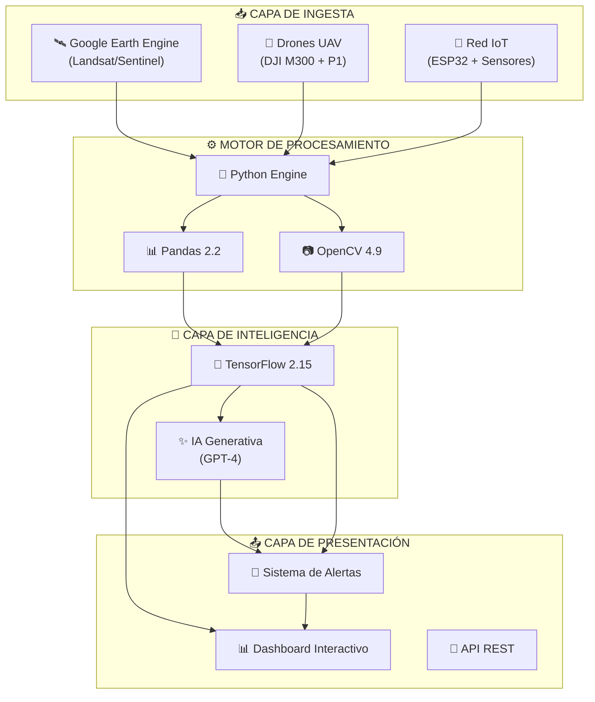
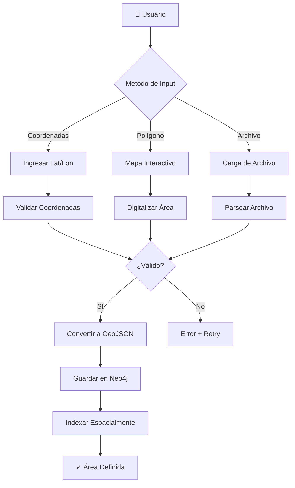
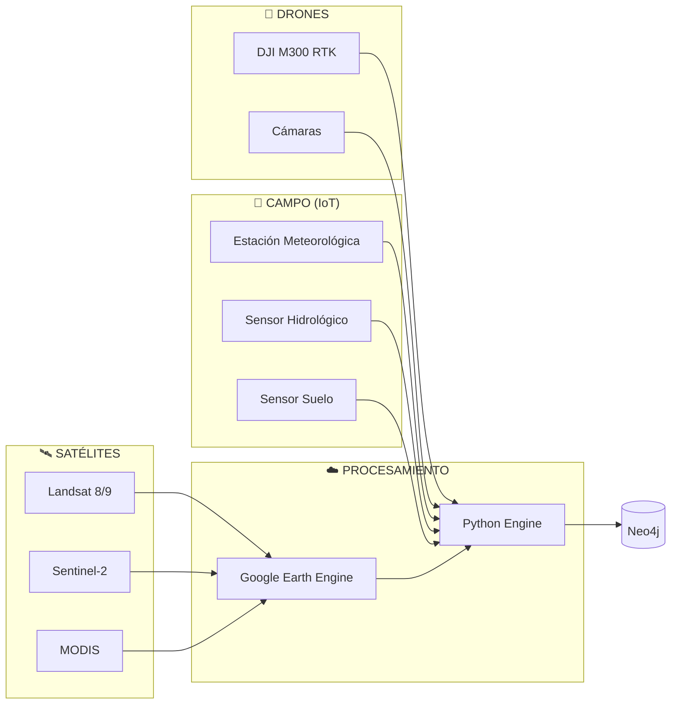
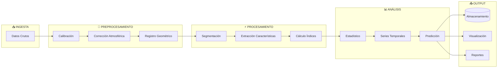
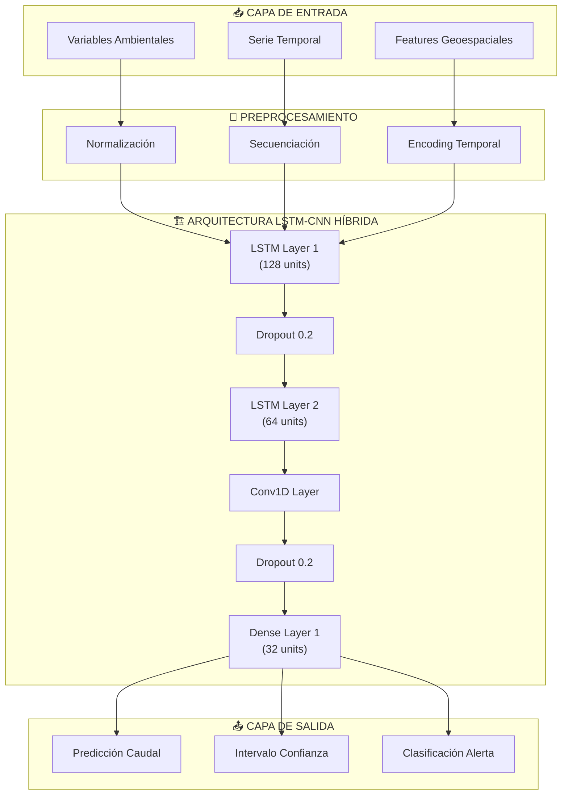
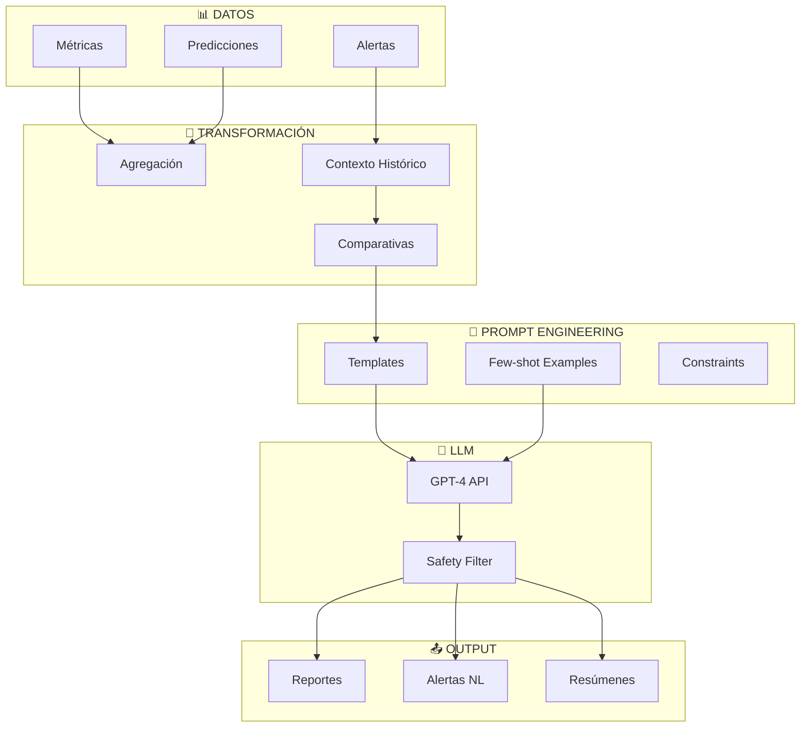
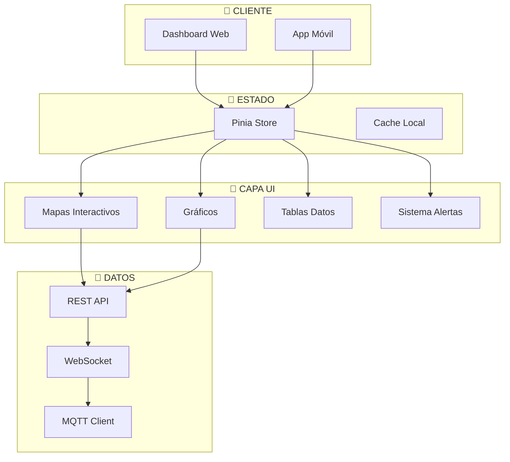
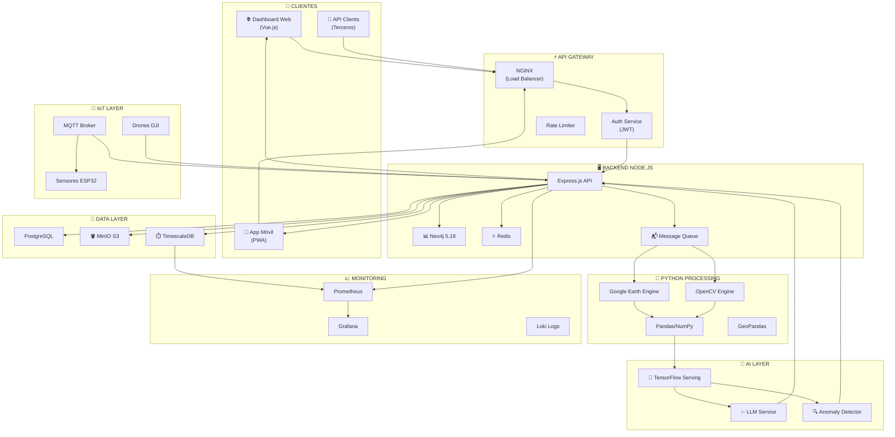

# 🌊 Skyfusion Analytics


---

## 📋 Resumen Ejecutivo

**Skyfusion Analytics** es una plataforma SaaS de análisis multitemporal y predicción ambiental diseñada para el monitoreo y gestión inteligente de cuencas hidrográficas. El sistema integra tecnologías de teledetección satelital, sensores IoT y drones UAV para proporcionar una visión holística del estado hídrico de un territorio.

La plataforma fue desarrollada específicamente para la **cuenca del río Combeima** en Ibagué, Colombia, con el objetivo de:

- **Monitorear** en tiempo real variables ambientales críticas (caudal, precipitación, temperatura, humedad, cobertura vegetal)
- **Predecir** eventos críticos relacionados con fenómenos climáticos como El Niño
- **Alertar** tempranamente a entidades gubernamentales y comunidades sobre riesgos de desastres
- **Evaluar** la oferta hídrica y su vulnerabilidad frente a cambios climáticos

El núcleo de inteligencia artificial procesa datos geoespaciales mediante redes neuronales LSTM-CNN híbridas, mientras que un módulo de IA generativa traduce las métricas complejas en narrativas comprensibles para decisores no técnicos.

---

## 🎯 Visión de Producto

### Plataforma SaaS Multisectorial

Skyfusion Analytics representa un paradigma en la gestión ambiental digital. Aunque nació específicamente para resolver los desafíos de la gestión hídrica en la cuenca del río Combeima, su **arquitectura intrínsecamente modular** permite la extrapolación a cualquier territorio y variable ambiental.

### Principios Arquitecturales

| Principio | Implementación |
|-----------|----------------|
| **Domain-Driven Design** | Bounded contexts separados para cada dominio (agua, vegetación, clima, alertas) |
| **Extensibilidad** | Plugins寒w para incorporar nuevas fuentes de datos y sensores |
| **Escalabilidad Horizontal** | Contenedores Docker/Kubernetes para procesamiento paralelo |
| **Multi-tenant** | Aislamiento de datos por región/organización |
| **API-First** | Arquitectura RESTful para integración con sistemas externos |

### Aplicaciones Transversales

La arquitectura de Skyfusion no está limitada al dominio hídrico. El mismo motor de procesamiento puede configurarse para:

- **Agricultura de Precisión**: Monitoreo de estrés hídrico en cultivos, predicción de rindes
- **Gestión de Riesgos Urbanos**: Evaluación de vulnerabilidad a inundaciones, islas de calor
- **Minería Responsable**: Control de sedimentación, monitoreo de lixiviados
- **Conservación Ambiental**: Seguimiento de biodiversidad, corredores biológicos
- **Infraestructura Crítica**: Estabilidad de laderas, integridad de represas

---

## 🌍 Contexto Estratégico

### Problemática Regional

La región del Tolima y particularmente el municipio de Ibagué enfrentan desafíos críticos relacionados con el ciclo hídrico:

#### Fenómeno de El Niño

| Aspecto | Impacto |
|---------|---------|
| **Precipitación** | Reducción del 40-60% durante eventos fuertes |
| **Temperatura** | Incremento de 2-4°C en promedio |
| **Evapotranspiración** | Aumento del 30% en demanda hídrica |
| **Duración** | 6-18 meses por evento |

#### Crisis de Oferta Hídrica

- La cuenca del río Combeima es la **principal fuente de agua potable** para más de 500,000 habitantes
- La deforestación en zonas altas ha reducido la capacidad de retención hídrica
- Los patrones de precipitación históricos ya no son confiables para planificación
- El crecimiento urbano sin planificación ha incrementado la impermeabilización del suelo

#### Riesgos de Desastres

- **Inundaciones** en temporada de lluvias intensificadas
- **Avenidas torrenciales** por pérdida de cobertura vegetal
- **Escasez aguda** durante sequías prolongadas
- **Conflictos sociales** por competencia por el recurso hídrico

### Justificación de Skyfusion

La combinación de estos factores hace imperativo un sistema que:

1. **Cuantifique** con precisión la oferta hídrica disponible
2. **Modele** escenarios futuros bajo diferentes condiciones climáticas
3. **Anticipe** crisis mediante predicción basada en datos
4. **Facilite** la toma de decisiones con información accesible y comprensible

---

## 🏗️ Arquitectura del Sistema

### Vista General



### Descripción de Capas

#### Capa de Ingesta

Responsabilidades:
- Conexión con APIs de terceros (Google Earth Engine, proveedores de drones)
- Reception de telemetry desde sensores IoT via MQTT
- Normalización de formatos heterogéneos
- Validación de integridad de datos

Tecnologías:
- **Google Earth Engine Client** (`earthengine-api` Python)
- **MQTT Broker** (Mosquitto/EMQX)
- **FUSE.js** para validación de archivos geoespaciales

#### Capa de Procesamiento

Responsabilidades:
- Preprocesamiento de imágenes satelitales y UAV
- Calculo de índices espectrales (NDVI, NDWI)
- Análisis estadístico de series temporales
- Generación de productos geoespaciales intermedios

Tecnologías:
- **Python 3.11** con entornos virtuales
- **OpenCV 4.9** para visión computacional
- **Pandas 2.2** + **NumPy** para análisis numérico
- **Rasterio** para manejo de datos raster

#### Capa de Inteligencia Artificial

Responsabilidades:
- Entrenamiento y served de modelos predictivos
- Inferencia en tiempo real
- Generación de narrativas en lenguaje natural
- Detección de anomalías

Tecnologías:
- **TensorFlow 2.15** (modelos LSTM-CNN híbridos)
- **OpenAI GPT-4 API** para generación de texto
- **TensorFlow Serving** para producción

#### Capa de Presentación

Responsabilidades:
- Visualización de datos geoespaciales
- Renderizado de mapas interactivos
- Presentación de alertas y predicciones
- Interfaz de administración

Tecnologías:
- **Leaflet/Mapbox GL JS** para mapas
- **Chart.js** para gráficos temporales
- **Vue.js 3** para UI reactiva

---

## 🗺️ Módulo de Definición de Área Geoespacial

### Descripción Funcional

El módulo de input geoespacial es el punto de entrada fundamental para cualquier análisis en Skyfusion. Permite a los usuarios definir con precisión las áreas de estudio mediante múltiples métodos complementarios.

### Métodos de Input Soportados

| Método | Descripción | Precisión | Formatos Soportados |
|--------|-------------|-----------|---------------------|
| **Coordenadas GPS** | Punto único con radio de influencia | Depende del dispositivo | Lat/Lon decimales |
| **Polígono Interactivo** | Dibujo manual en mapa | Configurable (10m-1km) | GeoJSON, WKT |
| **Carga Vectorial** | Importación de archivos predefinidos | Depende de fuente | GeoJSON, KML, Shapefile (.shp) |

### Diagrama de Flujo del Módulo



### Ejemplo de GeoJSON de Entrada

```json
{
  "type": "FeatureCollection",
  "crs": {
    "type": "name",
    "properties": {
      "name": "urn:ogc:def:crs:EPSG::4326"
    }
  },
  "bbox": [-75.257, 4.433, -75.142, 4.529],
  "features": [
    {
      "type": "Feature",
      "id": "combeima_zone_001",
      "geometry": {
        "type": "Polygon",
        "coordinates": [[
          [-75.257, 4.433],
          [-75.142, 4.433],
          [-75.142, 4.529],
          [-75.257, 4.529],
          [-75.257, 4.433]
        ]]
      },
      "properties": {
        "id": "combeima_zone_001",
        "nombre": "Cuenca Alta Combeima",
        "area_hectareas": 12450.75,
        "tipo_zona": "estudio_hidrologico",
        "elevacion_min_m": 800,
        "elevacion_max_m": 4200,
        "fecha_creacion": "2026-03-31",
        "creator": "skyfusion_system",
        "metadata": {
          "fuente": "IGAC 1:25000",
          "ultima_actualizacion": "2026-03-15",
          "precision_m": 30
        }
      }
    },
    {
      "type": "Feature",
      "id": "combeima_subzone_002",
      "geometry": {
        "type": "Point",
        "coordinates": [-75.1995, 4.4810]
      },
      "properties": {
        "id": "combeima_subzone_002",
        "nombre": "Estación Poblado",
        "tipo": "estacion_monitoreo",
        "sensores_activos": ["caudal", "precipitacion", "temperatura"],
        "estado": "operativo"
      }
    }
  ]
}
```

### Validación de Geometrías

```javascript
// Ejemplo de validación en Node.js
const validateGeoJSON = (geojson) => {
  const errors = [];
  
  // Verificar estructura básica
  if (!geojson.type) {
    errors.push('Falta propiedad "type"');
  }
  
  // Verificar CRS
  if (!geojson.crs?.properties?.name?.includes('EPSG')) {
    errors.push('CRS debe estar en formato EPSG');
  }
  
  // Verificar geometrías
  geojson.features?.forEach((feature, index) => {
    if (!feature.geometry) {
      errors.push(`Feature ${index}: Falta geometría`);
    }
    
    if (!isValidCoordinates(feature.geometry?.coordinates)) {
      errors.push(`Feature ${index}: Coordenadas inválidas`);
    }
    
    // Verificar bounding box razonable para Colombia
    const coords = feature.geometry?.coordinates;
    if (coords) {
      const [lon, lat] = Array.isArray(coords[0]) ? coords[0][0] : coords;
      if (lat < -4.2 || lat > 13 || lon < -79 || lon > -66) {
        errors.push(`Feature ${index}: Coordenadas fuera de Colombia`);
      }
    }
  });
  
  return {
    valid: errors.length === 0,
    errors
  };
};
```

---

## 🔧 Stack Tecnológico Escalable

### Tabla Comparativa de Tecnologías

| Componente | Tecnología | Versión | Función Core | Documentación |
|-------------|------------|---------|--------------|---------------|
| **Backend Core** | Node.js | 20.x LTS | API REST, orquestación de servicios | [docs](https://nodejs.org/docs/) |
| **Framework HTTP** | Express.js | 4.18.x | Middleware, routing, handlers | [docs](https://expressjs.com/) |
| **Base de Datos Grafo** | Neo4j | 5.18 Community | Relaciones geoespaciales complejas | [docs](https://neo4j.com/docs/) |
| **Data Engine** | Python | 3.11.x | Procesamiento científico de datos | [docs](https://docs.python.org/3.11/) |
| **Visión Computacional** | OpenCV | 4.9.x | Segmentación, detección, procesamiento | [docs](https://docs.opencv.org/4.9/) |
| **Análisis Numérico** | Pandas | 2.2.x | Series temporales, manipulación tabular | [docs](https://pandas.pydata.org/docs/) |
| **Computación Numérica** | NumPy | 1.26.x | Arrays, algebra lineal | [docs](https://numpy.org/doc/stable/) |
| **IA Predictiva** | TensorFlow | 2.15.x | Modelos LSTM/CNN híbridos | [docs](https://www.tensorflow.org/api_docs/) |
| **IA Generativa** | OpenAI GPT-4 | API v1 | Generación de narrativas NL | [docs](https://platform.openai.com/docs/) |
| **Mapas Web** | Leaflet | 1.9.x | Visualización geoespacial interactiva | [docs](https://leafletjs.com/reference.html) |
| **Mapas Avanzados** | Mapbox GL JS | 3.x | Mapas 3D, estilos custom | [docs](https://docs.mapbox.com/mapbox-gl-js/) |
| **Gráficos** | Chart.js | 4.x | Series temporales, KPIs | [docs](https://www.chartjs.org/docs/) |
| **Frontend Framework** | Vue.js | 3.4.x | UI reactiva, componentes | [docs](https://vuejs.org/guide/) |
| **Teledetección** | Google Earth Engine | API | Acceso a Landsat, Sentinel | [docs](https://developers.google.com/earth-engine/) |
| **Telemetría IoT** | MQTT | 5.0 | Protocolo pub/sub sensores | [docs](https://mqtt.org/) |
| **Orquestación** | Docker | 24.x | Contenedores, aislamiento | [docs](https://docs.docker.com/) |

### Arquitectura Detallada por Capa

#### Backend Node.js 20.x

```
backend/
├── src/
│   ├── controllers/           # Handlers HTTP (responsabilidad única)
│   │   ├── zoneController.js
│   │   ├── analysisController.js
│   │   ├── predictionController.js
│   │   └── reportController.js
│   ├── services/              # Lógica de negocio (dominio)
│   │   ├── geospatialService.js
│   │   ├── ingestionService.js
│   │   ├── alertService.js
│   │   └── mlOrchestrator.js
│   ├── models/                # Modelos Neo4j
│   │   ├── Station.js
│   │   ├── Sensor.js
│   │   ├── Measurement.js
│   │   └── Zone.js
│   ├── routes/                # Definición de rutas
│   │   ├── v1/
│   │   │   ├── zones.js
│   │   │   ├── analysis.js
│   │   │   ├── predictions.js
│   │   │   └── reports.js
│   ├── middleware/            # Cross-cutting concerns
│   │   ├── authMiddleware.js
│   │   ├── validationMiddleware.js
│   │   ├── errorHandler.js
│   │   └── rateLimiter.js
│   ├── utils/                 # Helpers
│   │   ├── geojsonValidator.js
│   │   ├── coordinateUtils.js
│   │   └── logger.js
│   ├── config/                # Configuraciones
│   │   ├── database.js
│   │   ├── cache.js
│   │   └── externalApis.js
│   └── app.js                 # Entry point
```

**Endpoints API Principales:**

| Método | Endpoint | Descripción |
|--------|----------|-------------|
| GET | `/api/v1/zones` | Listar todas las zonas de estudio |
| POST | `/api/v1/zones` | Crear nueva zona (requiere GeoJSON) |
| GET | `/api/v1/zones/:id` | Obtener zona por ID |
| PUT | `/api/v1/zones/:id` | Actualizar zona |
| DELETE | `/api/v1/zones/:id` | Eliminar zona |
| POST | `/api/v1/analysis/ndvi` | Calcular NDVI para zona |
| POST | `/api/v1/analysis/ndwi` | Calcular NDWI para zona |
| GET | `/api/v1/analysis/trends` | Obtener tendencias temporales |
| POST | `/api/v1/predictions/flow` | Predecir caudal |
| GET | `/api/v1/predictions/alerts` | Obtener alertas activas |
| POST | `/api/v1/reports/generate` | Generar reporte con IA |
| GET | `/api/v1/reports/history` | Historial de reportes |

#### Motor Python 3.11

```
processing/
├── src/
│   ├── opencv/                # Módulos de visión computacional
│   │   ├── image_segmentation.py
│   │   ├── object_detection.py
│   │   ├── ortho_processing.py
│   │   └── texture_analysis.py
│   ├── pandas/                # Análisis de datos
│   │   ├── time_series_analysis.py
│   │   ├── statistical_metrics.py
│   │   ├── data_forecasting.py
│   │   └── data_quality.py
│   ├── indices/               # Índices espectrales
│   │   ├── ndvi.py
│   │   ├── ndwi.py
│   │   ├── evi.py
│   │   └── custom_indices.py
│   ├── ml/                    # Modelos de machine learning
│   │   ├── data_preprocessor.py
│   │   ├── model_training.py
│   │   ├── model_inference.py
│   │   └── anomaly_detector.py
│   ├── gee/                   # Integración GEE
│   │   ├── landsat_processor.py
│   │   ├── sentinel_processor.py
│   │   └── gee_utils.py
│   └── config.py              # Configuraciones
├── notebooks/                 # Jupyter notebooks exploratorios
├── data/                      # Datos (raw y procesados)
│   ├── raw/
│   ├── processed/
│   └── models/
├── requirements.txt
└── Dockerfile
```

#### Base de Datos Neo4j 5.18

**Modelo de Nodos:**

```cypher
// Definición de nodos
(:Zone {
  id: string,
  name: string,
  area_ha: float,
  created_at: datetime
})

(:Station {
  id: string,
  name: string,
  type: string, // 'weather' | 'hydrological' | 'air'
  lat: float,
  lon: float,
  status: string
})

(:Sensor {
  id: string,
  type: string, // 'caudal' | 'precipitacion' | 'temperatura' | 'humedad'
  unit: string,
  calibration_date: datetime
})

(:Measurement {
  id: string,
  value: float,
  timestamp: datetime,
  quality: string // 'valid' | 'suspect' | 'invalid'
})

(:Analysis {
  id: string,
  type: string, // 'ndvi' | 'ndwi' | 'trend'
  result: object,
  timestamp: datetime
})

(:Alert {
  id: string,
  level: string, // 'green' | 'yellow' | 'orange' | 'red'
  message: string,
  timestamp: datetime,
  acknowledged: boolean
})
```

**Modelo de Relaciones:**

```cypher
// Relaciones principales
(zone:Zone)-[:CONTAINS]->(station:Station)
(station:Station)-[:HAS_SENSOR]->(sensor:Sensor)
(sensor:Sensor)-[:MEASURES]->(measurement:Measurement)
(zone:Zone)-[:HAS_ANALYSIS]->(analysis:Analysis)
(zone:Zone)-[:HAS_ALERT]->(alert:Alert)
(station1:Station)-[:CONNECTS_TO {distance_km: float}]->(station2:Station)
```

**Consultas Geoespaciales:**

```cypher
// Encontrar todas las estaciones dentro de un radio de un punto
MATCH (s:Station)
WHERE point.distance(
  point({longitude: s.lon, latitude: s.lat}),
  point({longitude: -75.1995, latitude: 4.4810})
) < 5000  // 5km en metros
RETURN s

// Encontrar zona que contiene una coordenada
MATCH (z:Zone)
WHERE z.boundaryPolygon CONTAINS point({longitude: -75.2, latitude: 4.45})
RETURN z

// Ruta de monitoreo: estaciones conectadas aguas arriba-aguas abajo
MATCH path = (s1:Station)-[:CONNECTS_TO*]->(s2:Station)
WHERE s1.id = 'station_001' AND s2.id = 'station_010'
RETURN path
```

---

## 📡 Ecosistema de Sensores y Teledetección

### Tabla Comparativa de Fuentes de Datos

| Fuente | Plataforma/Sensor | Resolución Espacial | Resolución Temporal | Variables Medidas | Latencia | Costo Operativo |
|--------|-------------------|--------------------|---------------------|-------------------|----------|-----------------|
| **Landsat 8/9** | OLI/TIRS | 30m (bands), 15m (pan) | 16 días | NDVI, NDWI, LST, Reflectancia | 24-48h | Gratuito |
| **Sentinel-2** | MSI | 10m (VNIR), 20m (SWIR) | 5 días | NDVI, NDWI, Clorofila, Turbidez | 1-6h | Gratuito |
| **MODIS** | Terra/Aqua | 250m-1km | Diario | Temperatura, Vegetación, Nieve | 2-4h | Gratuito |
| **Dron DJI M300** | Zenmuse P1 | 5-20cm | Bajo demanda | RGB, Multiespectral, Termal | <1h | Alto |
| **Sensores IoT** | ESP32 + HW | Punto (estación) | 1-5 min | Caudal, Precipitación, T°, Humedad | <1min | Medio |

### Diagrama de Integración de Fuentes



### Integración con Google Earth Engine

```python
# Ejemplo: Extracción de serie NDVI para zona
import ee
ee.Initialize()

def get_ndvi_time_series(geometry, start_date, end_date):
    """
    Obtiene serie temporal NDVI para un polígono GeoJSON.
    
    Args:
        geometry: GeoJSON polygon coordinates
        start_date: Fecha inicio (YYYY-MM-DD)
        end_date: Fecha fin (YYYY-MM-DD)
    
    Returns:
        DataFrame con valores NDVI por fecha
    """
    # Definir área de estudio
    aoi = ee.Geometry.Polygon(geometry['coordinates'])
    
    # Colección Sentinel-2
    collection = (ee.ImageCollection('COPERNICUS/S2_HARMONIZED')
        .filterDate(start_date, end_date)
        .filterBounds(aoi)
        .filter(ee.Filter.lt('CLOUDY_PIXEL_PERCENTAGE', 20)))
    
    # Función para calcular NDVI
    def calc_ndvi(image):
        ndvi = image.normalizedDifference(['B8', 'B4']).rename('NDVI')
        return image.addBands(ndvi).copyProperties(
            image, ['system:time_start'])
    
    # Mapear sobre colección
    ndvi_collection = collection.map(calc_ndvi)
    
    # Reducir a la media del área
    def reduce_region(image):
        stats = image.select('NDVI').reduceRegion(
            reducer=ee.Reducer.mean(),
            geometry=aoi,
            scale=10,  # Resolución Sentinel-2
            bestEffort=True
        )
        return ee.Feature(None, {
            'date': image.date().format('YYYY-MM-dd'),
            'ndvi_mean': stats.get('NDVI'),
            'ndvi_std': stats.get('NDVI_stdDev')
        })
    
    features = ndvi_collection.map(reduce_region)
    fc = features.filter(ee.Filter.notNull(['ndvi_mean']))
    
    # Exportar a DataFrame (via Earth Engine API)
    return ee.data.computeFeatures({
        'expression': fc,
        'fileFormat': 'PANDAS_DATAFRAME'
    })
```

### Pipeline de Telemetría IoT

```javascript
// Ejemplo: Suscriptor MQTT para datos de sensores
const mqtt = require('mqtt');
const neo4j = require('neo4j-driver');

const client = mqtt.connect('mqtt://broker.local:1883');
const driver = neo4j.driver('bolt://localhost:7687');

client.subscribe('sensors/combeima/#');

client.on('message', async (topic, message) => {
    const [,, stationId, sensorType] = topic.split('/');
    const data = JSON.parse(message);
    
    const session = driver.session();
    
    try {
        // Crear medición y relacionar
        await session.run(`
            MATCH (s:Sensor {id: $sensorId})
            CREATE (m:Measurement {
                id: randomUUID(),
                value: $value,
                timestamp: datetime($timestamp),
                quality: 'valid'
            })
            CREATE (s)-[:MEASURES]->(m)
            RETURN m
        `, {
            sensorId: `${stationId}_${sensorType}`,
            value: data.value,
            timestamp: data.timestamp
        });
        
        // Verificar umbrales para alertas
        await checkThresholds(sensorType, data.value);
        
    } finally {
        await session.close();
    }
});

async function checkThresholds(sensorType, value) {
    const thresholds = {
        caudal: { min: 0.5, max: 50 },
        precipitacion: { max: 100 },
        temperatura: { min: -5, max: 45 },
        humedad: { min: 10, max: 100 }
    };
    
    const t = thresholds[sensorType];
    if (t && (value < t.min || value > t.max)) {
        // Generar alerta
        console.log(`⚠️ ALERTA: ${sensorType} = ${value}`);
    }
}
```

---

## ⚙️ Pipeline de Procesamiento

### Flujo de Procesamiento de Datos



### Módulos de Procesamiento OpenCV

```python
# processing/src/opencv/image_segmentation.py
import cv2
import numpy as np
from pathlib import Path

class WaterBodySegmentator:
    """
    Segmenta cuerpos de agua utilizando umbrales en espacio de color
    y refinamiento con operaciones morfológicas.
    """
    
    def __init__(self, config: dict = None):
        self.config = config or {
            'ndwi_threshold': 0.0,
            'kernel_size': 5,
            'min_area_px': 100
        }
    
    def segment(self, green_band: np.ndarray, nir_band: np.ndarray) -> dict:
        """
        Segmenta cuerpos de agua usando NDWI modificado.
        
        Args:
            green_band: Banda verde (Green)
            nir_band: Banda infrarroja cercana (NIR)
        
        Returns:
            Dictionary con máscara y estadísticas
        """
        # Calcular NDWI
        ndwi = self._calculate_ndwi(green_band, nir_band)
        
        # Aplicar umbral
        mask = (ndwi > self.config['ndwi_threshold']).astype(np.uint8)
        
        # Operaciones morfológicas
        kernel = cv2.getStructuringElement(
            cv2.MORPH_ELLIPSE,
            (self.config['kernel_size'],) * 2
        )
        mask = cv2.morphologyEx(mask, cv2.MORPH_OPEN, kernel)
        mask = cv2.morphologyEx(mask, cv2.MORPH_CLOSE, kernel)
        
        # Filtrar por área mínima
        mask = self._filter_by_area(mask)
        
        # Calcular estadísticas
        stats = self._compute_statistics(mask, ndwi)
        
        return {
            'mask': mask,
            'ndwi': ndwi,
            'statistics': stats
        }
    
    def _calculate_ndwi(self, green: np.ndarray, nir: np.ndarray) -> np.ndarray:
        """NDWI = (Green - NIR) / (Green + NIR)"""
        green = green.astype(np.float32)
        nir = nir.astype(np.float32)
        
        denominator = green + nir + 1e-10
        ndwi = (green - nir) / denominator
        
        return np.clip(ndwi, -1, 1)
    
    def _filter_by_area(self, mask: np.ndarray) -> np.ndarray:
        """Elimina regiones pequeñas (ruido)."""
        num_labels, labels, stats, _ = cv2.connectedComponentsWithStats(
            mask, connectivity=8
        )
        
        filtered_mask = np.zeros_like(mask)
        for i in range(1, num_labels):  # Skip background
            if stats[i, cv2.CC_STAT_AREA] >= self.config['min_area_px']:
                filtered_mask[labels == i] = 1
        
        return filtered_mask
    
    def _compute_statistics(self, mask: np.ndarray, ndwi: np.ndarray) -> dict:
        """Calcula estadísticas de la segmentación."""
        water_pixels = mask == 1
        total_pixels = mask.size
        
        return {
            'water_pixels': int(np.sum(water_pixels)),
            'water_percentage': float(np.sum(water_pixels) / total_pixels * 100),
            'mean_ndwi': float(np.mean(ndwi[water_pixels])) if np.any(water_pixels) else 0,
            'max_ndwi': float(np.max(ndwi[water_pixels])) if np.any(water_pixels) else 0,
            'min_ndwi': float(np.min(ndwi[water_pixels])) if np.any(water_pixels) else 0
        }
```

### Módulos de Análisis Pandas

```python
# processing/src/pandas/time_series_analysis.py
import pandas as pd
import numpy as np
from typing import Optional

class TimeSeriesAnalyzer:
    """
    Analiza series temporales de datos de sensores.
    Calcula tendencias, estacionalidad y anomalías.
    """
    
    def __init__(self, df: pd.DataFrame):
        """
        Args:
            df: DataFrame con columnas ['timestamp', 'value', 'sensor_id']
        """
        self.df = df.copy()
        self.df['timestamp'] = pd.to_datetime(self.df['timestamp'])
        self.df = self.df.set_index('timestamp').sort_index()
    
    def calculate_trend(self, window: int = 30) -> pd.Series:
        """
        Calcula tendencia usando media móvil.
        
        Returns:
            Serie con valores de tendencia
        """
        return self.df['value'].rolling(
            window=window,
            center=True,
            min_periods=1
        ).mean()
    
    def detect_anomalies(self, method: str = 'iqr', threshold: float = 1.5) -> pd.Series:
        """
        Detecta anomalías usando IQR o Z-score.
        
        Args:
            method: 'iqr' o 'zscore'
            threshold: Multiplicador para IQR o umbral Z-score
        
        Returns:
            Boolean Series indicando anomalías
        """
        if method == 'iqr':
            q1 = self.df['value'].quantile(0.25)
            q3 = self.df['value'].quantile(0.75)
            iqr = q3 - q1
            lower = q1 - threshold * iqr
            upper = q3 + threshold * iqr
            return (self.df['value'] < lower) | (self.df['value'] > upper)
        
        elif method == 'zscore':
            z_scores = np.abs(
                (self.df['value'] - self.df['value'].mean()) / 
                self.df['value'].std()
            )
            return z_scores > threshold
    
    def seasonal_decomposition(self, period: int = 24) -> dict:
        """
        Descompone la serie en tendencia, estacionalidad y residuo.
        
        Args:
            period: Período de estacionalidad (horas para datos horarios)
        
        Returns:
            Dictionary con componentes
        """
        from statsmodels.tsa.seasonal import seasonal_decompose
        
        result = seasonal_decompose(
            self.df['value'].dropna(),
            model='additive',
            period=period
        )
        
        return {
            'trend': result.trend,
            'seasonal': result.seasonal,
            'residual': result.resid,
            'observed': result.observed
        }
    
    def calculate_correlations(self, other: pd.DataFrame) -> pd.Series:
        """
        Calcula correlación con otra variable.
        
        Args:
            other: DataFrame con índices de tiempo alineados
        
        Returns:
            Series con coeficientes de correlación móvil
        """
        merged = pd.merge(
            self.df[['value']],
            other,
            left_index=True,
            right_index=True,
            how='outer'
        ).fillna(method='ffill').fillna(method='bfill')
        
        return merged['value'].corr(merged[other.columns[0]])
```

### Cálculo de Índices Espectrales

```python
# processing/src/indices/ndvi.py
import numpy as np
from typing import Tuple, Optional

class SpectralIndices:
    """
    Biblioteca de cálculos para índices espectrales.
    Optimizado para procesamiento en batch de imágenes satelitales.
    """
    
    @staticmethod
    def calculate_ndvi(
        nir: np.ndarray, 
        red: np.ndarray,
        output_scale: bool = True
    ) -> np.ndarray:
        """
        Calcula NDVI (Normalized Difference Vegetation Index).
        
        NDVI = (NIR - Red) / (NIR + Red)
        
        Args:
            nir: Banda NIR (infrarrojo cercano)
            red: Banda Red (rojo)
            output_scale: Si True, escala a 0-255 para visualización
        
        Returns:
            Array NDVI normalizado
        """
        nir = nir.astype(np.float32)
        red = red.astype(np.float32)
        
        denominator = nir + red
        ndvi = np.where(
            denominator != 0,
            (nir - red) / denominator,
            0
        )
        
        if output_scale:
            # Escalar de [-1, 1] a [0, 255]
            return ((ndvi + 1) * 127.5).astype(np.uint8)
        
        return ndvi
    
    @staticmethod
    def calculate_ndwi(
        green: np.ndarray,
        nir: np.ndarray,
        output_scale: bool = True
    ) -> np.ndarray:
        """
        Calcula NDWI (Normalized Difference Water Index).
        
        NDWI = (Green - NIR) / (Green + NIR)
        
        Args:
            green: Banda Green (verde)
            nir: Banda NIR (infrarrojo cercano)
            output_scale: Si True, escala a 0-255
        
        Returns:
            Array NDWI normalizado
        """
        green = green.astype(np.float32)
        nir = nir.astype(np.float32)
        
        denominator = green + nir
        ndwi = np.where(
            denominator != 0,
            (green - nir) / denominator,
            0
        )
        
        if output_scale:
            return ((ndwi + 1) * 127.5).astype(np.uint8)
        
        return ndwi
    
    @staticmethod
    def calculate_evi(
        nir: np.ndarray,
        red: np.ndarray,
        blue: Optional[np.ndarray] = None,
        g: float = 2.5,
        c1: float = 6.0,
        c2: float = 7.5,
        l: float = 1.0
    ) -> np.ndarray:
        """
        Calcula EVI (Enhanced Vegetation Index).
        
        EVI = G * (NIR - Red) / (NIR + C1*Red - C2*Blue + L)
        
        Args:
            nir, red, blue: Bandas espectrales
            g, c1, c2, l: Coeficientes del índice
        
        Returns:
            Array EVI
        """
        if blue is None:
            raise ValueError("Blue band es requerida para EVI")
        
        nir = nir.astype(np.float32)
        red = red.astype(np.float32)
        blue = blue.astype(np.float32)
        
        denominator = nir + c1 * red - c2 * blue + l
        evi = np.where(
            denominator != 0,
            g * (nir - red) / denominator,
            0
        )
        
        return np.clip(evi, -1, 1)
    
    @staticmethod
    def interpret_ndvi(ndvi_value: float) -> dict:
        """
        Interpreta valor NDVI para categorización.
        
        Returns:
            Dictionary con categoría y color
        """
        if ndvi_value < 0.1:
            return {
                'category': 'suelo_desnudo',
                'color': '#8B4513',
                'vegetation': 'Ninguna'
            }
        elif ndvi_value < 0.3:
            return {
                'category': 'vegetacion_escasa',
                'color': '#CD853F',
                'vegetation': 'Baja'
            }
        elif ndvi_value < 0.6:
            return {
                'category': 'vegetacion_moderada',
                'color': '#228B22',
                'vegetation': 'Moderada'
            }
        else:
            return {
                'category': 'vegetacion_densa',
                'color': '#006400',
                'vegetation': 'Alta'
            }
```

---

## 🧠 Componente de IA Predictiva

### Arquitectura del Modelo



### Variables de Entrada

| Variable | Unidad | Fuente | Frecuencia | Rango Típico |
|----------|--------|--------|------------|--------------|
| **Caudal** | m³/s | Sensores IoT | 5 min | 0.5 - 50 |
| **Precipitación** | mm | Sensores/GEE | 1h | 0 - 100 |
| **Temperatura** | °C | Sensores/GEE | 1h | 10 - 35 |
| **Humedad Relativa** | % | Sensores/GEE | 1h | 30 - 100 |
| **Cobertura Vegetal** | NDVI (0-1) | GEE/Sentinel | 16 días | 0.2 - 0.8 |
| **Índice Hídrico** | NDWI (0-1) | GEE/Sentinel | 16 días | -0.5 - 0.5 |
| **Evapotranspiración** | mm/día | GEE/MODIS | Diario | 1 - 8 |

### Implementación TensorFlow

```python
# processing/src/ml/model_training.py
import tensorflow as tf
from tensorflow.keras.layers import (
    LSTM, Dense, Conv1D, Dropout, 
    Bidirectional, Attention, LayerNormalization
)
from tensorflow.keras.models import Sequential, Model
from tensorflow.keras.callbacks import EarlyStopping, ModelCheckpoint
from tensorflow.keras.optimizers import Adam

class HybridLSTMCNNPredictor:
    """
    Modelo LSTM-CNN híbrido para predicción de caudal.
    Combina capacidad de secuencias de LSTM con extracción de características de CNN.
    """
    
    def __init__(self, config: dict = None):
        self.config = config or self._default_config()
        self.model = None
        self.history = None
    
    def _default_config(self) -> dict:
        return {
            'input_steps': 72,      # 72 horas de datos históricos
            'output_steps': 24,     # Predicción 24 horas ahead
            'n_features': 7,       # Variables de entrada
            'lstm_units_1': 128,
            'lstm_units_2': 64,
            'cnn_filters': 64,
            'kernel_size': 3,
            'dense_units': 32,
            'dropout_rate': 0.2,
            'learning_rate': 0.001,
            'batch_size': 32,
            'epochs': 100
        }
    
    def build_model(self) -> tf.keras.Model:
        """
        Construye arquitectura LSTM-CNN híbrida.
        
        Returns:
            Model compilado de TensorFlow
        """
        inputs = tf.keras.Input(
            shape=(self.config['input_steps'], self.config['n_features']),
            name='input_layer'
        )
        
        # Bloque LSTM bidireccional
        x = Bidirectional(
            LSTM(self.config['lstm_units_1'], 
                return_sequences=True,
                dropout=self.config['dropout_rate']),
            name='bi_lstm_1'
        )(inputs)
        
        x = Bidirectional(
            LSTM(self.config['lstm_units_2'],
                return_sequences=False,
                dropout=self.config['dropout_rate']),
            name='bi_lstm_2'
        )(x)
        
        # Bloque CNN 1D
        x = tf.keras.layers.Reshape(
            (1, self.config['lstm_units_2'] * 2),
            name='reshape'
        )(x)
        
        x = Conv1D(
            filters=self.config['cnn_filters'],
            kernel_size=self.config['kernel_size'],
            activation='relu',
            padding='same',
            name='conv1d'
        )(x)
        
        x = Dropout(self.config['dropout_rate'], name='dropout_cnn')(x)
        
        # Capas densas de predicción
        x = Dense(self.config['dense_units'], activation='relu', name='dense_1')(x)
        x = LayerNormalization(name='layer_norm')(x)
        
        # Salidas múltiples
        # 1. Predicción de caudal (regresión)
        flow_output = Dense(
            self.config['output_steps'],
            activation='linear',
            name='flow_prediction'
        )(x)
        
        # 2. Intervalo de confianza (incertidumbre)
        uncertainty = Dense(
            self.config['output_steps'],
            activation='softplus',  # Siempre positivo
            name='uncertainty'
        )(x)
        
        # 3. Clasificación de alerta (4 niveles)
        alert_output = Dense(
            4,  # green, yellow, orange, red
            activation='softmax',
            name='alert_classification'
        )(x)
        
        model = Model(inputs=inputs, outputs=[flow_output, uncertainty, alert_output])
        
        # Compilar con múltiples pérdidas
        model.compile(
            optimizer=Adam(learning_rate=self.config['learning_rate']),
            loss={
                'flow_prediction': 'mse',
                'uncertainty': 'mse',  # Minimizar incertidumbre
                'alert_classification': 'sparse_categorical_crossentropy'
            },
            loss_weights={
                'flow_prediction': 1.0,
                'uncertainty': 0.1,
                'alert_classification': 0.5
            },
            metrics={
                'flow_prediction': ['mae', 'mse'],
                'alert_classification': ['accuracy']
            }
        )
        
        self.model = model
        return model
    
    def prepare_sequences(self, X: np.ndarray, y: np.ndarray) -> tuple:
        """
        Prepara secuencias para entrenamiento.
        
        Args:
            X: Features de entrada (n_samples, n_features)
            y: Targets (n_samples,)
        
        Returns:
            X_seq, y_seq listos para entrenamiento
        """
        sequences_x = []
        sequences_y = []
        
        for i in range(len(X) - self.config['input_steps'] - self.config['output_steps'] + 1):
            sequences_x.append(X[i:i + self.config['input_steps']])
            sequences_y.append(y[i + self.config['input_steps']:
                                  i + self.config['input_steps'] + self.config['output_steps']])
        
        return np.array(sequences_x), np.array(sequences_y)
    
    def train(
        self,
        X_train: np.ndarray,
        y_train: np.ndarray,
        X_val: np.ndarray = None,
        y_val: np.ndarray = None,
        callbacks: list = None
    ) -> tf.keras.callbacks.History:
        """
        Entrena el modelo con early stopping.
        """
        X_seq, y_seq = self.prepare_sequences(X_train, y_train)
        
        if X_val is not None:
            X_val_seq, y_val_seq = self.prepare_sequences(X_val, y_val)
            validation_data = (X_val_seq, {
                'flow_prediction': y_val_seq,
                'uncertainty': y_val_seq * 0.1,
                'alert_classification': np.zeros((len(y_val_seq), self.config['output_steps']))
            })
        else:
            validation_data = None
        
        default_callbacks = [
            EarlyStopping(
                monitor='val_loss',
                patience=10,
                restore_best_weights=True
            ),
            ModelCheckpoint(
                'models/best_model.keras',
                monitor='val_loss',
                save_best_only=True
            )
        ]
        
        self.history = self.model.fit(
            X_seq,
            {
                'flow_prediction': y_seq,
                'uncertainty': y_seq * 0.1,
                'alert_classification': np.zeros((len(y_seq), self.config['output_steps']))
            },
            validation_data=validation_data,
            epochs=self.config['epochs'],
            batch_size=self.config['batch_size'],
            callbacks=callbacks or default_callbacks
        )
        
        return self.history
    
    def predict(self, X_input: np.ndarray) -> dict:
        """
        Realiza predicción con el modelo entrenado.
        
        Returns:
            Dictionary con predicción, incertidumbre y alerta
        """
        if self.model is None:
            raise ValueError("Modelo no ha sido entrenado")
        
        X_seq = X_input.reshape(1, self.config['input_steps'], self.config['n_features'])
        flow, uncertainty, alert = self.model.predict(X_seq)
        
        # Convertir probabilidades de alerta a clase
        alert_classes = ['green', 'yellow', 'orange', 'red']
        predicted_alert = alert_classes[np.argmax(alert[0][0])]
        
        return {
            'flow_prediction': flow[0],
            'uncertainty': uncertainty[0],
            'confidence_interval': [
                flow[0] - 1.96 * uncertainty[0],
                flow[0] + 1.96 * uncertainty[0]
            ],
            'predicted_alert': predicted_alert,
            'alert_probabilities': alert[0][0].tolist()
        }
```

### Sistema de Alertas Tempranas

```python
# processing/src/ml/anomaly_detector.py
class AlertSystem:
    """
    Sistema de clasificación y generación de alertas.
    Implementa lógica de decisión multicriterio.
    """
    
    ALERT_THRESHOLDS = {
        'ndvi': {
            'green': 0.6,      # Vegetación saludable
            'yellow': 0.3,     # Vegetación moderada
            'orange': 0.2,     # Vegetación stress
            'red': 0.0         # Sin vegetación/sequía
        },
        'flow_change': {
            'green': 0.1,      # < 10% cambio
            'yellow': 0.2,    # 10-20% reducción
            'orange': 0.3,    # 20-30% reducción
            'red': 0.5        # > 50% reducción
        },
        'precipitation': {
            'green': (5, 100),     # Rango normal (mm/día)
            'yellow': (2, 5),      # Por debajo normal
            'orange': (0, 2),      # Escaso
            'red': (0, 0.5)       # Casi nulo
        }
    }
    
    def classify_alert(
        self,
        ndvi: float,
        current_flow: float,
        historical_flow_mean: float,
        precipitation_24h: float
    ) -> dict:
        """
        Clasifica nivel de alerta basado en múltiples variables.
        
        Returns:
            Dictionary con nivel, score y mensaje
        """
        scores = {
            'ndvi_score': self._score_ndvi(ndvi),
            'flow_score': self._score_flow_change(current_flow, historical_flow_mean),
            'precipitation_score': self._score_precipitation(precipitation_24h)
        }
        
        # Promedio ponderado
        weights = {'ndvi_score': 0.4, 'flow_score': 0.35, 'precipitation_score': 0.25}
        total_score = sum(scores[k] * weights[k] for k in scores)
        
        # Clasificación final
        if total_score >= 0.75:
            level = 'green'
        elif total_score >= 0.5:
            level = 'yellow'
        elif total_score >= 0.25:
            level = 'orange'
        else:
            level = 'red'
        
        return {
            'level': level,
            'score': round(total_score, 3),
            'component_scores': {k: round(v, 3) for k, v in scores.items()},
            'message': self._generate_message(level, scores),
            'recommended_actions': self._get_recommended_actions(level)
        }
    
    def _score_ndvi(self, ndvi: float) -> float:
        """Score 0-1 para NDVI (1 = mejor condición)."""
        thresholds = self.ALERT_THRESHOLDS['ndvi']
        if ndvi >= thresholds['green']:
            return 1.0
        elif ndvi >= thresholds['yellow']:
            return 0.75
        elif ndvi >= thresholds['orange']:
            return 0.5
        elif ndvi >= thresholds['red']:
            return 0.25
        else:
            return 0.0
    
    def _score_flow_change(
        self,
        current: float,
        historical_mean: float
    ) -> float:
        """Score basado en cambio de caudal respecto a histórico."""
        if historical_mean == 0:
            return 0.5
        
        change_ratio = (current - historical_mean) / historical_mean
        thresholds = self.ALERT_THRESHOLDS['flow_change']
        
        if change_ratio > thresholds['green']:
            return 1.0
        elif change_ratio > -thresholds['yellow']:
            return 0.75
        elif change_ratio > -thresholds['orange']:
            return 0.5
        elif change_ratio > -thresholds['red']:
            return 0.25
        else:
            return 0.0
    
    def _score_precipitation(self, precip_24h: float) -> float:
        """Score basado en precipitación últimas 24h."""
        thresholds = self.ALERT_THRESHOLDS['precipitation']
        
        if thresholds['green'][0] <= precip_24h <= thresholds['green'][1]:
            return 1.0
        elif thresholds['yellow'][0] <= precip_24h < thresholds['yellow'][1]:
            return 0.6
        elif thresholds['orange'][0] <= precip_24h < thresholds['orange'][1]:
            return 0.3
        else:
            return 0.0
    
    def _generate_message(self, level: str, scores: dict) -> str:
        """Genera mensaje descriptivo para la alerta."""
        messages = {
            'green': "Condiciones normales. El sistema hídrico opera dentro de parámetros esperados.",
            'yellow': "Vigilancia recomendada. Se observan desviaciones moderadas que requieren monitoreo.",
            'orange': "Alerta activa. Condiciones adversas podrían escalar si continúan.",
            'red': "EMERGENCIA hídrica. Intervención inmediata recomendada."
        }
        return messages[level]
    
    def _get_recommended_actions(self, level: str) -> list:
        """Acciones recomendadas según nivel de alerta."""
        actions = {
            'green': [
                "Continuar monitoreo rutinario",
                "Reporte mensual standard"
            ],
            'yellow': [
                "Aumentar frecuencia de monitoreo",
                "Notificar a equipo técnico",
                "Revisar predicciones a 7 días"
            ],
            'orange': [
                "Emitir notificación a entidades",
                "Activar plan de contingencia",
                "Preparar comunicación a comunidades",
                "Evaluar restricciones de uso"
            ],
            'red': [
                "ACTIVAR PROTOCOLO DE EMERGENCIA",
                "Notificar inmediatamente a Alcaldía",
                "Coordinar con Defensa Civil",
                "Emitir alerta pública",
                "Evaluar restricción total de uso"
            ]
        }
        return actions[level]
```

---

## ✨ Módulo de IA Generativa

### Arquitectura del Pipeline de Generación



### Implementación del Generador de Reportes

```python
# processing/src/ml/report_generator.py
import json
from typing import Optional
from dataclasses import dataclass
from datetime import datetime

@dataclass
class ReportContext:
    """Contexto de datos para generación de reportes."""
    zone_name: str
    period_start: datetime
    period_end: datetime
    ndvi_mean: float
    ndvi_trend: str
    flow_mean: float
    flow_change_pct: float
    precipitation_mm: float
    temperature_mean: float
    active_alerts: int
    risk_level: str

class ReportGenerator:
    """
    Generador de reportes en lenguaje natural usando IA generativa.
    Transforma datos complejos en narrativas comprensibles.
    """
    
    SYSTEM_PROMPT = """Eres un analista ambiental experto en gestión hídrica 
    colombiana con 15 años de experiencia. Tu función es generar reportes 
    técnicos claros y actionable para alcaldías y entes ambientales.
    
    DIRECTRICES:
    - Usa lenguaje técnico pero accesible
    - Include cifras específicas de los datos proporcionados
    - Compara con valores históricos cuando sea relevante
    - Sugiere acciones concretas basadas en la evidencia
    - NO inventes datos - solo usa los proporcionados
    - Sé conciso pero completo"""
    
    REPORT_TEMPLATES = {
        'daily': """
        ## Resumen Diario - {zone_name}
        **{date}**
        
        ### Condiciones Actuales
        {current_conditions}
        
        ### Tendencias
        {trends}
        
        ### Predicciones
        {predictions}
        
        ### Recomendaciones
        {recommendations}
        """,
        
        'weekly': """
        ## Informe Semanal - {zone_name}
        **{week_start} al {week_end}**
        
        ### Resumen Ejecutivo
        {executive_summary}
        
        ### Análisis de Variables
        {variable_analysis}
        
        ### Comparativa Histórica
        {historical_comparison}
        
        ### Alertas Activas
        {active_alerts}
        
        ### Acciones Recomendadas
        {recommended_actions}
        """,
        
        'alert': """
        ## 🚨 ALERTA {level}: {alert_type}
        **{timestamp}** - {zone_name}
        
        ### Descripción
        {description}
        
        ### Datos de Soporte
        {supporting_data}
        
        ### Impacto Potencial
        {potential_impact}
        
        ### Acciones Inmediatas Requeridas
        {immediate_actions}
        """
    }
    
    def __init__(self, api_key: str, model: str = "gpt-4-turbo"):
        self.api_key = api_key
        self.model = model
        self.client = OpenAI(api_key=api_key)
    
    def generate_daily_report(self, context: ReportContext) -> str:
        """
        Genera reporte diario en lenguaje natural.
        """
        # Preparar contexto para el prompt
        prompt_context = {
            'zone': context.zone_name,
            'date': context.period_end.strftime('%Y-%m-%d'),
            'ndvi': f"{context.ndvi_mean:.2f}",
            'ndvi_trend': context.ndvi_trend,
            'flow': f"{context.flow_mean:.2f}",
            'flow_change': f"{context.flow_change_pct:+.1f}%",
            'precip': f"{context.precipitation_mm:.1f}",
            'temp': f"{context.temperature_mean:.1f}",
            'alerts': context.active_alerts,
            'risk': context.risk_level.upper()
        }
        
        # Construir prompt detallado
        user_prompt = f"""
        Genera un reporte diario para la zona {prompt_context['zone']} 
        con fecha {prompt_context['date']}.
        
        DATOS DEL DÍA:
        - NDVI promedio: {prompt_context['ndvi']} (tendencia: {prompt_context['ndvi_trend']})
        - Caudal promedio: {prompt_context['flow']} m³/s ({prompt_context['flow_change']} vs histórico)
        - Precipitación: {prompt_context['precip']} mm
        - Temperatura promedio: {prompt_context['temp']} °C
        - Alertas activas: {prompt_context['alerts']}
        - Nivel de riesgo: {prompt_context['risk']}
        
        Incluye:
        1. Descripción de condiciones actuales de la cuenca
        2. Análisis de tendencias (¿mejora o empeora?)
        3. Predicción para las próximas 24-48 horas
        4. Recomendaciones específicas para hoy
        """
        
        response = self._call_llm(user_prompt)
        return response
    
    def generate_alert_narrative(
        self,
        alert_level: str,
        alert_data: dict,
        zone_name: str
    ) -> str:
        """
        Genera narrativa de alerta comprensible para público general.
        """
        level_messages = {
            'green': "Condiciones normales",
            'yellow': "Vigilancia",
            'orange': "Alerta",
            'red': "EMERGENCIA"
        }
        
        user_prompt = f"""
        Genera una notificación de alerta para {zone_name}.
        
        NIVEL: {level_messages.get(alert_level, alert_level)}
        
        DATOS TÉCNICOS:
        {json.dumps(alert_data, indent=2)}
        
        REQUISITOS:
        1. Título claro con nivel de alerta
        2. Descripción del problema en lenguaje no técnico
        3. Qué significa esto para los ciudadanos
        4. Qué acciones deben tomar
        5. Qué están haciendo las autoridades
        
        El tono debe ser informativo pero urgente (especialmente para naranja/rojo).
        """
        
        response = self._call_llm(user_prompt)
        return response
    
    def _call_llm(self, user_prompt: str, temperature: float = 0.3) -> str:
        """
        Llama a la API de OpenAI con el prompt construido.
        """
        response = self.client.chat.completions.create(
            model=self.model,
            messages=[
                {"role": "system", "content": self.SYSTEM_PROMPT},
                {"role": "user", "content": user_prompt}
            ],
            temperature=temperature,  # Baja temperatura para factualidad
            max_tokens=2000,
            top_p=0.95
        )
        
        return response.choices[0].message.content
    
    def generate_executive_summary(
        self,
        reports: list,
        period_days: int = 7
    ) -> str:
        """
        Genera resumen ejecutivo combinando múltiples reportes.
        """
        # Agregar métricas clave
        avg_ndvi = sum(r.ndvi_mean for r in reports) / len(reports)
        avg_flow = sum(r.flow_mean for r in reports) / len(reports)
        total_alerts = sum(r.active_alerts for r in reports)
        
        user_prompt = f"""
        Genera un resumen ejecutivo para alcaldías y decisores.
        
        PERÍODO: Últimos {period_days} días
        ZONA: {reports[0].zone_name}
        
        MÉTRICAS CLAVE:
        - NDVI promedio: {avg_ndvi:.2f}
        - Caudal promedio: {avg_flow:.2f} m³/s
        - Total alertas: {total_alerts}
        - Tendencia general: {'MEJORA' if reports[-1].ndvi_mean > reports[0].ndvi_mean else 'DETERIORO'}
        
        REQUISITOS:
        1. Máximo 3 párrafos
        2. Usar formato bullets para datos clave
        3. Incluir prognosis a 30 días
        4. Sugerir 2-3 acciones prioritarias
        """
        
        return self._call_llm(user_prompt, temperature=0.2)
```

### Tipos de Reportes Automatizados

| Tipo | Frecuencia | Destinatario | Contenido | Extensión |
|------|------------|--------------|-----------|-----------|
| **Diario Operativo** | 24h | Operadores de monitoreo | Métricas básicas, alertas activas | 1 página |
| **Semanal Técnico** | 7 días | Equipo técnico | Análisis tendencias, predicciones | 3-5 páginas |
| **Mensual Ejecutivo** | 30 días | Directivos, Alcaldía | Resumen KPIs, comparativas, prognosis | 8-10 páginas |
| **Alerta Crítica** | Evento | Todos los stakeholders | Notificación inmediata con acciones | < 1 página |
| **Informe Especial** | Bajo demanda | Entidades reguladoras | Análisis detallado de incidentes | Variable |

---

## 📊 Dashboard e Interfaz

### Arquitectura del Frontend



### Componentes Principales

| Componente | Tecnología | Función | Estado |
|-------------|------------|---------|--------|
| **Map Viewer** | Leaflet 1.9 + Mapbox GL | Visualización geoespacial | ✅ Implementado |
| **Chart Dashboard** | Chart.js 4 | Series temporales | ✅ Implementado |
| **Alert Panel** | Vue.js 3 | Sistema de notificaciones | ✅ Implementado |
| **Data Tables** | AG Grid | Tablas de datos complejos | ✅ Implementado |
| **Report Viewer** | PDF.js | Visualización reportes | 🔄 En desarrollo |
| **Real-time KPIs** | Socket.io | Actualización en vivo | 🔄 En desarrollo |

### Características del Dashboard

#### Mapa Interactivo

- **Capas configurables**: Satelital, híbrido, terreno
- **Overlays**: Zonas de estudio, estaciones, alertas
- **Herramientas**: Zoom, pan, medición de distancias
- **Popup information**: Click en elementos para detalles
- **Time slider**: Animación temporal de datos

#### Panel de Control (KPIs)

```
┌─────────────────────────────────────────────────────────────┐
│  🌡️ Temperatura          💧 Caudal              🌧️ Precip   │
│  ━━━━━━━━━━━━━━━━━       ━━━━━━━━━━━━━━━━━      ━━━━━━━━━━  │
│  28.5°C ▲ +2.1°          12.3 m³/s ▼ -15%        0.2mm ▼     │
│  [Gráfico sparkline]     [Gráfico sparkline]     [Historial]│
└─────────────────────────────────────────────────────────────┘

┌─────────────────────────────────────────────────────────────┐
│  🌿 NDVI (Vegetación)     💧 NDWI (Agua)        🚨 Alertas  │
│  ━━━━━━━━━━━━━━━━━       ━━━━━━━━━━━━━━━━━      ━━━━━━━━━━  │
│  0.52 ⚠️ Moderada         0.15 ⚠️ Bajo          2 activas   │
│  [Mapa de calor]          [Mapa de calor]         [Ver más]  │
└─────────────────────────────────────────────────────────────┘
```

---

## 🛤️ Roadmap de Escalabilidad

### Estrategia de Extensión Multi-sectorial

```mermaid
flowchart LR
    subgraph Core["⚙️ NÚCLEO SKYFUSION"]
        BASE["Base Hídrica"]
        ARCH["Arquitectura Modular"]
    end
    
    BASE --> AGRI["🌾 Agricultura"]
    BASE --> URBAN["🏙️ Urbano"]
    BASE --> MINING["⛏️ Minería"]
    BASE --> CONSER["🌳 Conservación"]
    
    ARCH --> AGRI
    ARCH --> URBAN
    ARCH --> MINERIA
    ARCH --> CONSER
    
    URBAN -.-> "Infraestructura"
    URBAN -.-> "Movilidad"
    URBAN -.-> "Energía"
    
    AGRI -.-> "Cultivos"
    AGRI -.-> "Riego"
    AGRI -.-> "Plagas"
```

### Sectores de Aplicación

| Sector | Variables Adicionales | Casos de Uso | Entidades Objetivo |
|--------|----------------------|--------------|-------------------|
| **Agricultura de Precisión** | Humedad suelo, estrés hídrico, biomasa | Riego optimizado, predicción rindes, detección plagas | Cooperativas, agroindustria |
| **Gestión Urbana** | Calidad aire, islas de calor, ruido | Planificación urbana, movilidad | Alcaldías, planeación |
| **Minería Responsable** | Sedimentación, lixiviados, subsidencia | Monitoreo ambiental, compliance | Mineras, autoridades |
| **Conservación** | Biodiversidad, corredores, fuegos | Áreas protegidas, fauna | Parques, ONGs |
| **Infraestructura** | Estabilidad slopes, vibraciones | Riesgo construcciones, puentes | Ingenieros, aseguradoras |

### Fases de Expansión

#### Fase 1: Consolidación (Año 1)
- ✅ Estabilización módulo hídrico Combeima
- ✅ Integración sensores IoT en producción
- 🔄 Validación modelos predictivos

#### Fase 2: Expansión Geográfica (Año 2)
- 📋 Cuenca del río Magdalena
- 📋 Costa Caribe colombiana
- 📋 Adaptation a ecosistemas andinos

#### Fase 3: Diversificación Sectorial (Año 3)
- 📋 Módulo agrícola (pilot con Fedegan)
- 📋 Módulo urbano (pilot con Ibagué)
- 📋 API pública para desarrolladores

---

## 📁 Mejores Prácticas de Ingeniería

### Estructura de Carpetas Sugerida

```
skyfusion-analytics/
├── backend/                          # Node.js API
│   ├── src/
│   │   ├── controllers/             # Handlers HTTP
│   │   │   ├── zoneController.js
│   │   │   ├── analysisController.js
│   │   │   ├── predictionController.js
│   │   │   └── reportController.js
│   │   ├── services/                # Lógica de negocio
│   │   │   ├── geospatialService.js
│   │   │   ├── ingestionService.js
│   │   │   ├── alertService.js
│   │   │   └── mlOrchestrator.js
│   │   ├── models/                  # Modelos Neo4j
│   │   │   ├── Station.js
│   │   │   ├── Sensor.js
│   │   │   ├── Measurement.js
│   │   │   └── Zone.js
│   │   ├── routes/                  # Definición rutas
│   │   │   └── v1/
│   │   ├── middleware/              # Cross-cutting
│   │   │   ├── authMiddleware.js
│   │   │   ├── validationMiddleware.js
│   │   │   └── errorHandler.js
│   │   ├── utils/                   # Helpers
│   │   │   ├── geojsonValidator.js
│   │   │   └── logger.js
│   │   ├── config/                  # Configuraciones
│   │   └── app.js                   # Entry point
│   ├── tests/                       # Pruebas
│   │   ├── unit/
│   │   ├── integration/
│   │   └── e2e/
│   ├── config/
│   │   ├── default.json
│   │   └── production.json
│   ├── package.json
│   └── .env.example
│
├── processing/                       # Python Engine
│   ├── src/
│   │   ├── opencv/                 # Visión computacional
│   │   ├── pandas/                 # Análisis datos
│   │   ├── indices/                # Índices espectrales
│   │   │   ├── __init__.py
│   │   │   ├── ndvi.py
│   │   │   ├── ndwi.py
│   │   │   └── evi.py
│   │   ├── ml/                     # Machine learning
│   │   ├── gee/                    # Google Earth Engine
│   │   └── config.py
│   ├── notebooks/                  # Jupyter exploratorios
│   ├── tests/
│   │   ├── test_indices.py
│   │   └── test_processing.py
│   ├── data/
│   │   ├── raw/                    # Datos originales
│   │   ├── processed/              # Datos transformados
│   │   └── models/                 # Modelos entrenados
│   ├── requirements.txt
│   ├── setup.py
│   └── Dockerfile
│
├── frontend/                        # Dashboard
│   ├── src/
│   │   ├── components/             # Componentes Vue
│   │   │   ├── map/
│   │   │   ├── charts/
│   │   │   ├── alerts/
│   │   │   └── common/
│   │   ├── views/                  # Páginas
│   │   │   ├── Dashboard.vue
│   │   │   ├── MapView.vue
│   │   │   ├── Reports.vue
│   │   │   └── Settings.vue
│   │   ├── stores/                 # Pinia stores
│   │   │   ├── zones.js
│   │   │   ├── measurements.js
│   │   │   └── alerts.js
│   │   ├── api/                    # Cliente HTTP
│   │   ├── router/                 # Vue Router
│   │   ├── assets/
│   │   └── main.js
│   ├── public/
│   ├── tests/
│   ├── package.json
│   └── vite.config.js
│
├── infrastructure/                 # DevOps
│   ├── docker/
│   │   ├── backend/
│   │   ├── processing/
│   │   └── frontend/
│   ├── kubernetes/
│   ├── terraform/
│   └── monitoring/
│
├── docs/                           # Documentación
│   ├── api/
│   ├── architecture/
│   └── guides/
│
├── .gitignore
├── .editorconfig
├── .prettierrc
├── eslint.config.js
└── README.md
```

### Variables de Entorno

```bash
# =============================================================================
# SKYFUSION ANALYTICS - Variables de Entorno
# =============================================================================

# -----------------------------------------------------------------------------
# NODE.JS BACKEND
# -----------------------------------------------------------------------------
NODE_ENV=development
PORT=3000

# Neo4j Database
NEO4J_URI=bolt://localhost:7687
NEO4J_USER=neo4j
NEO4J_PASSWORD=change_this_secure_password

# JWT Authentication
JWT_SECRET=your_jwt_secret_min_32_chars
JWT_EXPIRES_IN=24h

# Redis Cache
REDIS_HOST=localhost
REDIS_PORT=6379
REDIS_PASSWORD=

# -----------------------------------------------------------------------------
# PYTHON PROCESSING ENGINE
# -----------------------------------------------------------------------------
PYTHON_ENV=production
TF_CPP_MIN_LOG_LEVEL=2
OPENCV_ENABLE_NONFREE=0
OMP_NUM_THREADS=4

# Google Earth Engine
GEE_SERVICE_ACCOUNT=skyfusion@project.iam.gserviceaccount.com
GEE_PRIVATE_KEY_PATH=/secrets/gee-private-key.json

# -----------------------------------------------------------------------------
# ML & AI SERVICES
# -----------------------------------------------------------------------------
# OpenAI (IA Generativa)
OPENAI_API_KEY=sk-proj-xxxxxxxxxxxxxxxxxxxx
OPENAI_ORG_ID=org-xxxxxxxxxxxxx

# Hugging Face (Modelos open source)
HF_API_TOKEN=hf_xxxxxxxxxxxxxxxxxxxx

# Model paths
MODEL_PATH=/models
MODEL_VERSION=1.0.0

# -----------------------------------------------------------------------------
# FRONTEND (Vite)
# -----------------------------------------------------------------------------
VITE_API_URL=http://localhost:3000/api/v1
VITE_WS_URL=ws://localhost:3000
VITE_MAPBOX_TOKEN=pk.eyJ1IjoidXNlcm5hbWUiLCJhIjoiY2xz...

# -----------------------------------------------------------------------------
# IoT & SENSORS
# -----------------------------------------------------------------------------
MQTT_BROKER_URL=mqtt://localhost:1883
MQTT_USERNAME=
MQTT_PASSWORD=
MQTT_TOPIC_PREFIX=sensors/combeima

# -----------------------------------------------------------------------------
# STORAGE
# -----------------------------------------------------------------------------
MINIO_ENDPOINT=localhost:9000
MINIO_ACCESS_KEY=minioadmin
MINIO_SECRET_KEY=minioadmin
MINIO_BUCKET_RAW=skyfusion-raw
MINIO_BUCKET_PROCESSED=skyfusion-processed
MINIO_BUCKET_MODELS=skyfusion-models

# -----------------------------------------------------------------------------
# MONITORING
# -----------------------------------------------------------------------------
PROMETHEUS_ENABLED=true
GRAFANA_URL=http://localhost:3001
SENTRY_DSN=https://xxxxx@sentry.io/xxxxx
```

### Estándares de Código

#### Clean Code Principles

| Principio | Aplicación en Skyfusion |
|-----------|-------------------------|
| **SRP** (Single Responsibility) | Cada servicio una responsabilidad única |
| **OCP** (Open/Closed) | Extensión via plugins, no modificación |
| **LSP** (Liskov Substitution) | Interfaces genéricas para替换 |
| **ISP** (Interface Segregation) | APIs pequeñas y específicas |
| **DIP** (Dependency Inversion) | Inyección de dependencias |

#### Convenciones de Nomenclatura

```javascript
// Variables y funciones: camelCase
const flowRate = 12.5;
function calculateNDVI(nir, red) { ... }

// Clases: PascalCase
class WaterBodySegmentator { ... }
class AlertSystem { ... }

// Constantes: UPPER_SNAKE_CASE
const MAX_RETRY_ATTEMPTS = 3;
const API_BASE_URL = '/api/v1';

// Archivos: kebab-case
// zone-controller.js
// time-series-analysis.py
// ndvi-calculator.ts
```

#### Documentación de API

```markdown
## API Reference v1.0

### Zones

#### GET /api/v1/zones
Lista todas las zonas de estudio.

**Query Parameters:**
| Parameter | Type | Required | Description |
|-----------|------|----------|-------------|
| page | int | No | Número de página (default: 1) |
| limit | int | No | Items por página (default: 20, max: 100) |
| status | string | No | Filtrar por estado |

**Response (200):**
```json
{
  "data": [
    {
      "id": "zone_001",
      "name": "Cuenca Alta Combeima",
      "area_ha": 12450.75,
      "center": { "lat": 4.481, "lon": -75.199 },
      "status": "active",
      "created_at": "2026-01-15T00:00:00Z"
    }
  ],
  "meta": {
    "page": 1,
    "limit": 20,
    "total": 5
  }
}
```

#### POST /api/v1/zones
Crea una nueva zona de estudio.

**Request Body:**
```json
{
  "name": "Nueva Zona",
  "geometry": { /* GeoJSON Polygon */ },
  "metadata": {
    "source": "user_import",
    "description": "Zona piloto"
  }
}
```

**Response (201):**
```json
{
  "id": "zone_006",
  "name": "Nueva Zona",
  "created_at": "2026-03-31T12:00:00Z"
}
```

### Analysis

#### POST /api/v1/analysis/ndvi
Calcula NDVI para una zona.

**Request Body:**
```json
{
  "zone_id": "zone_001",
  "start_date": "2026-01-01",
  "end_date": "2026-03-31",
  "source": "sentinel2"
}
```

**Response (200):**
```json
{
  "zone_id": "zone_001",
  "analysis_type": "ndvi_time_series",
  "data_points": 24,
  "results": [
    {
      "date": "2026-01-01",
      "ndvi_mean": 0.52,
      "ndvi_min": 0.31,
      "ndvi_max": 0.71,
      "trend": "stable"
    }
  ]
}
```

### Predictions

#### POST /api/v1/predictions/flow
Genera predicción de caudal.

**Request Body:**
```json
{
  "zone_id": "zone_001",
  "horizon_hours": 72,
  "confidence_level": 0.95
}
```

**Response (200):**
```json
{
  "zone_id": "zone_001",
  "prediction_horizon": 72,
  "generated_at": "2026-03-31T12:00:00Z",
  "predictions": [
    {
      "timestamp": "2026-04-01T00:00:00Z",
      "flow_m3s": 12.5,
      "lower_ci": 10.2,
      "upper_ci": 14.8,
      "alert_level": "green"
    }
  ],
  "model_info": {
    "name": "lstm_cnn_hybrid_v2",
    "accuracy_mae": 0.8,
    "validation_date": "2026-03-15"
  }
}
```
```

---

## 🔗 Diagrama de Arquitectura Completa



---

## 📊 Resumen de Capacidades

| Categoría | Capability | Status |
|-----------|-----------|--------|
| **Ingesta** | Google Earth Engine (Landsat/Sentinel) | ✅ |
| **Ingesta** | Drones UAV (DJI M300) | ✅ |
| **Ingesta** | Sensores IoT (MQTT) | ✅ |
| **Procesamiento** | OpenCV (segmentación) | ✅ |
| **Procesamiento** | Pandas (series temporales) | ✅ |
| **Procesamiento** | Cálculo NDVI/NDWI | ✅ |
| **IA Predictiva** | LSTM-CNN híbrido | ✅ |
| **IA Predictiva** | Sistema de alertas | ✅ |
| **IA Generativa** | Reportes en NL | ✅ |
| **Presentación** | Dashboard interactivo | ✅ |
| **Presentación** | Mapas georreferenciados | ✅ |
| **Infraestructura** | Docker containers | ✅ |
| **Infraestructura** | Neo4j graph DB | ✅ |

---

*Skyfusion Analytics - Monitoreo inteligente para un futuro hídrico sostenible*
