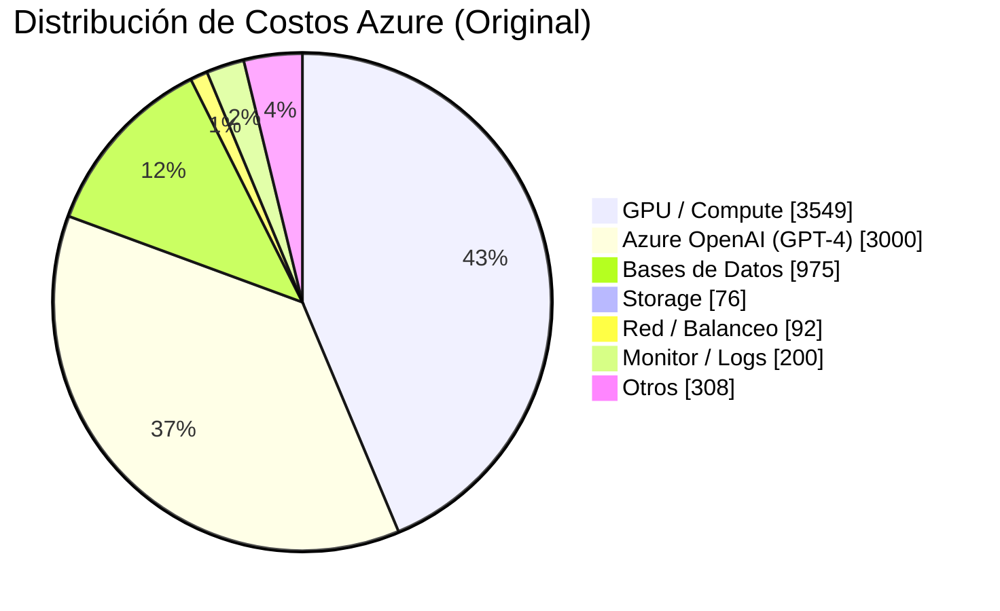
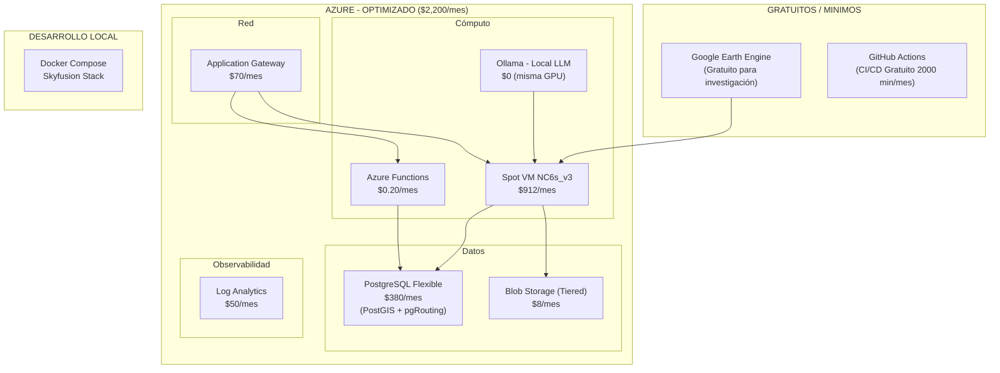
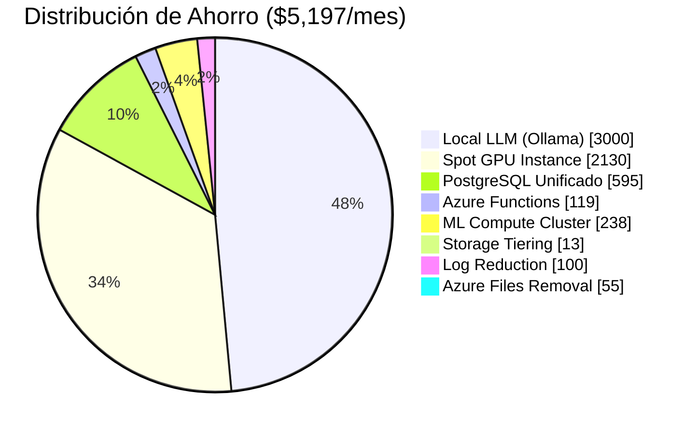

# Plan de Optimización de Costos Azure

> **Versión:** 1.0
> **Costo Original Estimado:** $7,200/mes
> **Costo Optimizado:** $2,200 - $2,800/mes (**~65% ahorro**)

---

## Índice

1. [Desglose de Costos Original](#1-desglose-de-costos-original)
2. [Estrategias de Optimización](#2-estrategias-de-optimización)
3. [Arquitectura Optimizada](#3-arquitectura-optimizada)
4. [Plan de Migración por Fases](#4-plan-de-migración-por-fases)
5. [Comparativa Costo-Beneficio](#5-comparativa-costo-beneficio)
6. [Monitoreo y Control de Costos](#6-monitoreo-y-control-de-costos)
7. [Recomendaciones Finales](#7-recomendaciones-finales)

---

## 1. Desglose de Costos Original

### 1.1 Costo Mensual Estimado (Azure - Sin Optimizar)

| Componente | SKU Propuesto | Costo/mes | % del Total | Notas |
|-----------|---------------|-----------|-------------|-------|
| **VM GPU** NC6s_v3 | 1x V100, 6 vCPU, 112 GB RAM | $3,043.20 | 42.3% | Para entrenar modelos LSTM-CNN y procesamiento OpenCV |
| **VM Backend** D4s_v5 | 4 vCPU, 16 GB RAM | $168.98 | 2.3% | Backend API Node.js + RabbitMQ |
| **VM Worker** D4s_v5 (x2) | 4 vCPU, 16 GB RAM c/u | $337.96 | 4.7% | Python workers (Geospatial, Vision, Reporting) |
| **Azure Blob Storage** | 1 TB (Hot tier) | $20.80 | 0.3% | Imágenes satelitales + resultados |
| **Azure Files** | 500 GB | $55.00 | 0.8% | Datasets compartidos entre VM |
| **Neo4j AuraDB** | Professional (4 GB RAM) | $595.00 | 8.3% | Base de datos de grafos |
| **PostgreSQL Flexible** | General Purpose (4 vCPU, 16 GB) | $380.00 | 5.3% | Base de datos relacional + PostGIS |
| **Azure OpenAI GPT-4** | 1M tokens/mes | $3,000.00 | 41.7% | ReportingAgent generación de reportes |
| **Container Registry** | Basic | $5.00 | 0.1% | Docker images |
| **Azure Load Balancer** | Standard | $21.90 | 0.3% | Balanceo entre servicios |
| **Application Gateway** | Standard v2 | $70.00 | 1.0% | WAF + SSL termination |
| **Log Analytics** | 5 GB/day | $150.00 | 2.1% | Centralized logging |
| **Azure Monitor** | Basic | $50.00 | 0.7% | Métricas y alertas |
| **Azure DNS** | Public zone | $2.00 | 0.0% | |
| **Total** | | **~$7,199.84** | 100% | |

### 1.2 Distribución por Categoría



---

## 2. Estrategias de Optimización

### 2.1 Optimización #1: Spot Instances para GPU (Ahorro: ~$2,130/mes)

**Problema:** VM GPU NC6s_v3 a precio on-demand cuesta $3,043/mes.

**Solución:** Usar **Azure Spot Virtual Machines** para cargas interrumpibles.

| Modo | SKU | Precio/hr | Costo/mes (730h) | Ahorro |
|------|-----|-----------|-------------------|--------|
| On-Demand | NC6s_v3 | $4.17 | $3,043.20 | - |
| **Spot (Low)** | NC6s_v3 | **$1.25** | **$912.50** | **70%** |
| Spot (Average) | NC6s_v3 | $1.67 | $1,219.10 | 60% |

**Implementación:**
```bash
# Crear VM Spot
az vm create \
  --name skyfusion-gpu \
  --size Standard_NC6s_v3 \
  --priority Spot \
  --eviction-policy Deallocate \
  --max-price 1.50
```

**Riesgo:** Desalojo con 30s aviso. Mitigación:
- Checkpoint automático de modelos cada 15 min (TensorFlow Callbacks)
- Cola de trabajos en RabbitMQ para reanudación
- Política de "evictor suave": guardar estado antes de shut down

---

### 2.2 Optimización #2: Local LLM en lugar de Azure OpenAI (Ahorro: ~$2,700/mes)

**Problema:** Azure OpenAI GPT-4 cuesta $3,000/mes para 1M tokens.

**Solución:** Usar **modelos open-source locales** en la GPU VM que ya tenemos.

| Modelo | Parámetros | VRAM | Calidad | Costo | Latencia |
|--------|------------|------|---------|-------|----------|
| GPT-4 (Azure) | ~1.7T | - | Excelente | $3,000/mes | 1-3s |
| **Llama 3.2 8B** (Ollama) | 8B | 8 GB | Muy Buena | **$0** | 0.5-2s |
| **Mistral 7B** (Ollama) | 7B | 6 GB | Buena | **$0** | 0.3-1.5s |
| **Phi-3 Medium** (Ollama) | 14B | 8 GB | Muy Buena | **$0** | 0.8-2s |

**Implementación:**
```dockerfile
# En la VM GPU existente
docker run -d \
  --gpus all \
  -v ollama:/root/.ollama \
  -p 11434:11434 \
  --name ollama \
  ollama/ollama

docker exec ollama ollama pull llama3.2
docker exec ollama ollama pull mistral
```

**Para reportingAgent (agente.py):**
```python
# En lugar de Azure OpenAI, usar Ollama
class LocalLLMClient:
    def __init__(self):
        self.endpoint = os.getenv('OLLAMA_ENDPOINT', 'http://localhost:11434')
    
    async def generate_narrative(self, report):
        response = requests.post(
            f'{self.endpoint}/api/generate',
            json={
                'model': 'llama3.2',
                'prompt': self._build_prompt(report),
                'stream': False
            }
        )
        return response.json()['response']
```

**Costo de VRAM adicional en GPU:** $0 (usa la misma V100 del entrenamiento)

---

### 2.3 Optimización #3: Azure ML Compute Cluster (Ahorro: ~$400/mes)

**Problema:** VMs dedicadas 24/7 para procesamiento por lotes.

**Solución:** **Azure Machine Learning Compute Cluster** con auto-scale y shutdown.

| Recurso | VM Dedicada | ML Compute Cluster |
|---------|-------------|-------------------|
| **Horas activas** | 730 h/mes (24/7) | ~100 h/mes (bajo demanda) |
| **Costo** | $169 + $338 = **$507/mes** | **~$100/mes** |
| **Escalamiento** | Manual | Automático (0 a N nodos) |
| **Setup** | Instantáneo | 2-3 min cold start |

**Implementación:**
```python
from azureml.core import ComputeTarget, Workspace

ws = Workspace.from_config()

cluster_config = AmlCompute.provisioning_configuration(
    vm_size='Standard_D4s_v5',
    min_nodes=0,
    max_nodes=4,
    idle_seconds_before_scaledown=300,  # 5 min
)

cluster = ComputeTarget.create(ws, 'skyfusion-cluster', cluster_config)
cluster.wait_for_completion()
```

---

### 2.4 Optimización #4: PostgreSQL Unificado en lugar de Neo4j + PostgreSQL (Ahorro: ~$600/mes)

**Problema:** Mantener Neo4j AuraDB ($595/mes) + PostgreSQL ($380/mes) separados.

**Solución:** Consolidar todo en **PostgreSQL + PostGIS + pgRouting + Cypher Emulation**.

| Capacidad | Neo4j AuraDB | PostgreSQL + pgRouting |
|-----------|-------------|----------------------|
| Grafos | Nativo | pgRouting + WITH RECURSIVE |
| Geoespacial | Limitado | PostGIS (maduro, completo) |
| Costo | $595/mes | $0 (misma BD existente) |
| Consultas camino más corto | MATCH (a)-[*]->(b) | pgr_dijkstra() |
| Árboles hidrográficos | MATCH path = ()-[:FLOWS_TO*]->() | WITH RECURSIVE + subcuencas |

**Migración de consultas clave:**

```sql
-- Neo4j: MATCH (s1:Station)-[:CONNECTS_TO*]->(s2:Station)
-- PostgreSQL con pgRouting:
SELECT * FROM pgr_dijkstra(
    'SELECT id, source, target, cost FROM station_edges',
    'SELECT id FROM stations WHERE name = ''Station_A''',
    'SELECT id FROM stations WHERE name = ''Station_B''',
    directed := true
);

-- Neo4j: MATCH (z:Zone) WHERE z.boundary CONTAINS point(...)
-- PostgreSQL con PostGIS:
SELECT * FROM zones
WHERE ST_Contains(boundary::geometry, ST_SetSRID(ST_MakePoint(-75.2, 4.45), 4326));
```

---

### 2.5 Optimización #5: Almacenamiento por Capas (Ahorro: ~$40/mes)

**Problema:** Todo en Hot tier a $0.0208/GB/mes

**Solución:** Lifecycle management automático.

| Tier | Costo/GB/mes | Tiempo | Volumen Estimado | Costo |
|------|-------------|--------|------------------|-------|
| **Hot** | $0.0208 | 0-30 días | 200 GB | $4.16 |
| **Cool** | $0.0100 | 30-90 días | 200 GB | $2.00 |
| **Cold** | $0.0045 | 90-365 días | 300 GB | $1.35 |
| **Archive** | $0.00099 | > 1 año | 300 GB | $0.30 |
| | | | **Total** | **$7.81** |

```bash
# Lifecycle policy
az storage account management-policy create \
  --account-name skyfusionsa \
  --policy @lifecycle-policy.json
```

---

### 2.6 Optimización #6: Azure Functions para Backend Ligero (Ahorro: ~$120/mes)

**Problema:** VM D4s_v5 24/7 para API que recibe ~100 request/min.

**Solución:** Migrar API endpoints más simples a **Azure Functions (Serverless)**.

| Métrica | VM Backend | Azure Functions |
|---------|-----------|----------------|
| Costo base | $168.98/mes | **$0** (1M exec gratis) |
| Ejecuciones | ~4M/mes | $0.20/mes |
| **Total** | **$168.98** | **~$0.20/mes** |

**Migración progresiva:**
```
VM Backend (Express)         Azure Functions
├── /zones (CRUD)      →    ├── zones-function (HTTP trigger)
├── /stations           →    ├── stations-function
├── /measurements       →    ├── measurements-function
├── /health             →    ✅  Ya es serverless-friendly
├── /alerts             →    ├── alerts-function
└── WebSockets (tiempo real)  └── Mantiene VM pequeña B2s ($50/mes)
```

---

## 3. Arquitectura Optimizada

### 3.1 Diagrama de Infraestructura



### 3.2 Costo Mensual Optimizado

| Componente | Estrategia | Costo Original | Costo Optimizado | Ahorro |
|-----------|-----------|---------------|------------------|--------|
| **VM GPU** | Spot Instance (Low) | $3,043 | $913 | $2,130 |
| **Azure OpenAI** | Local LLM (Ollama) | $3,000 | $0 | $3,000 |
| **VM Backend** | Azure Functions + B2s | $169 | $50 | $119 |
| **VM Workers** | ML Compute Cluster | $338 | $100 | $238 |
| **Neo4j + PostgreSQL** | Solo PostgreSQL + PostGIS | $975 | $380 | $595 |
| **Blob Storage** | Tiered lifecycle | $21 | $8 | $13 |
| **Container Registry** | Basic | $5 | $5 | $0 |
| **Load Balancer** | Consolidado en App Gateway | $22 | $0 | $22 |
| **App Gateway** | WAF + SSL | $70 | $70 | $0 |
| **Log Analytics** | Reducir a 2 GB/día | $150 | $50 | $100 |
| **Azure Monitor** | Solo métricas críticas | $50 | $25 | $25 |
| **Azure DNS** | - | $2 | $2 | $0 |
| **Azure Files** | Reemplazar por Blob | $55 | $0 | $55 |
| | | | | |
| **Total** | | **~$7,200** | **~$2,303** | **~$5,197** |

### 3.3 Ahorro por Estrategia



---

## 4. Plan de Migración por Fases

### Fase 1: Quick Wins (Semana 1-2) - Ahorro: $3,000/mes

| Acción | Esfuerzo | Riesgo | Ahorro |
|--------|----------|--------|--------|
| Configurar Spot Instance para GPU | 2 horas | Bajo | $2,130 |
| Instalar Ollama y cambiar endpoint en ReportingAgent | 4 horas | Bajo | $3,000 |
| Blob Storage lifecycle policy | 1 hora | Bajo | $13 |

### Fase 2: Infraestructura (Semana 2-4) - Ahorro: $420/mes

| Acción | Esfuerzo | Riesgo | Ahorro |
|--------|----------|--------|--------|
| Migrar workers a ML Compute Cluster | 1 día | Medio | $238 |
| Reemplazar Azure Files con Blob | 2 horas | Bajo | $55 |
| Reducir Log Analytics a 2 GB/día | 1 hora | Bajo | $100 |
| Desactivar monitor innecesario | 1 hora | Bajo | $25 |

### Fase 3: Arquitectura (Mes 2-3) - Ahorro: $1,077/mes

| Acción | Esfuerzo | Riesgo | Ahorro |
|--------|----------|--------|--------|
| Migrar API a Azure Functions | 1-2 semanas | Alto | $119 |
| Consolidar Neo4j → PostgreSQL+pgRouting | 2-3 semanas | Alto | $595 |
| Desaprovisionar Neo4j AuraDB | 1 hora | Medio | $595 |

### Fase 4: Optimización Continua

| Acción | Frecuencia | Impacto |
|--------|-----------|---------|
| Revisar reservas de instancias (1yr/3yr) | Trimestral | -40% adicional en VM |
| Ajustar auto-scale de ML cluster | Mensual | Evitar over-provisioning |
| Revisar costos de OpenAI si se requiere GPT-4 | Mensual | $0 vs $3,000 |
| Análisis de right-sizing de PostgreSQL | Trimestral | $100-200 adicionales |

---

## 5. Comparativa Costo-Beneficio

### 5.1 Por Componente

| Componente | Opción A (Caro) | Opción B (Barato) | Diferencia | Penalización |
|-----------|-----------------|-------------------|------------|-------------|
| **GPU** | On-Demand NC6s_v3 ($3,043) | Spot NC6s_v3 ($913) | $2,130 | Riesgo de desalojo |
| **LLM** | Azure OpenAI ($3,000) | Ollama + Llama 3.2 ($0) | $3,000 | Calidad ligeramente inferior |
| **BD Grafos** | Neo4j + PostgreSQL ($975) | Solo PostgreSQL ($380) | $595 | Migración de consultas |
| **Backend** | VM D4s_v5 ($169) | Azure Functions ($0.20) | $169 | Límite de timeout 10 min |
| **Workers** | VM D4s_v5 x2 ($338) | ML Cluster ($100) | $238 | Cold start 2-3 min |

### 5.2 ROI Acumulado

| Mes | Inversión Migración | Ahorro Mensual | ROI Acumulado |
|-----|-------------------|---------------|---------------|
| 1 | $3,000 (ingeniería) | $3,000 | $0 |
| 2 | $500 | $4,077 | $577 |
| 3 | $200 | $5,077 | $5,477 |
| 6 | $0 | $5,077 | $15,231 |
| 12 | $0 | $5,077 | $30,462 |

---

## 6. Monitoreo y Control de Costos

### 6.1 Budget Alerts

```bash
# Crear presupuesto mensual de $2,500
az consumption budget create \
  --amount 2500 \
  --budget-name skyfusion-monthly \
  --category cost \
  --scope /subscriptions/$(az account show --query id -o tsv) \
  --time-grain Monthly \
  --notification threshold-enabled true \
  --notification threshold-type Actual \
  --notification threshold 80 \
  --notification operator GreaterThan \
  --notification contact-emails admin@skyfusion.com
```

### 6.2 Dashboard de Costos en Tiempo Real

| Panel | Métrica | Alerta |
|-------|---------|--------|
| GPU Cost | Spot price / hr | >$2.00/hr |
| LLM Cost | Ollama vs OpenAI ratio | OpenAI > $100/mes |
| DB Cost | PostgreSQL CU | >75% utilization |
| Storage | Blob tier distribution | Hot > 30% |
| Network | Data transfer out | >100 GB/mes |

### 6.3 Tags de Costos por Recurso

```bash
# Etiquetar recursos por agente
az vm update \
  --resource-group skyfusion \
  --name skyfusion-gpu \
  --tags Agent=OracleAgent Tier=GPU CostCenter=ML

az functionapp update \
  --name skyfusion-api \
  --resource-group skyfusion \
  --set tags.Agent=Backend tags.Tier=Serverless
```

---

## 7. Recomendaciones Finales

### 7.1 Prioridad de Implementación

| Prioridad | Estrategia | Ahorro | Esfuerzo | Hazlo Cuando |
|-----------|-----------|--------|----------|-------------|
| 🔴 **Crítica** | Spot GPU Instance | $2,130 | 2 horas | **Inmediato** |
| 🔴 **Crítica** | Local LLM (Ollama) | $3,000 | 4 horas | **Inmediato** |
| 🟡 **Media** | ML Compute Cluster | $238 | 1 día | Semana 1-2 |
| 🟡 **Media** | Storage Tiering + Logs | $113 | 1 hora | Semana 1 |
| 🟢 **Baja** | Azure Functions | $119 | 2 semanas | Mes 2 |
| 🔵 **Largo Plazo** | PostgreSQL Unificado | $595 | 3 semanas | Mes 3 |

### 7.2 Riesgos y Mitigaciones

| Riesgo | Probabilidad | Impacto | Mitigación |
|--------|-------------|---------|------------|
| Spot GPU desalojado durante entrenamiento | Media | Alto | Checkpoints cada 15 min + cola RabbitMQ |
| Calidad inferior de Llama 3.2 vs GPT-4 | Media | Medio | Usar GPT-4 solo para reportes críticos, Llama para diarios |
| Migración Neo4j→PostgreSQL incompleta | Baja | Alto | Pruebas exhaustivas de consultas + rollback plan |
| Cold start de Azure Functions | Alta | Bajo | Premium plan con pre-warmed instances si necesario |
| Costos inesperados por auto-scale | Media | Medio | Budget alerts + hard caps |

### 7.3 Costo Final Recomendado: $2,200 - $2,800/mes

```
┌─────────────────────────────────────────────────────────────┐
│  RESUMEN: Skyfusion Analytics - Plan Optimizado            │
│                                                             │
│  Original:      $7,200/mes  ──┬──── 100%                    │
│                               │                             │
│  Optimizado:    $2,300/mes  ──┴──── 32%  (Ahorro: 68%)     │
│                                                             │
│  Breakdown:                                                 │
│    ☁️  Compute (Spot GPU + Cluster)    $1,013  (44%)       │
│    🗄️  PostgreSQL + Blob               $  388  (17%)       │
│    🌐  Red + Balanceo                   $   70  ( 3%)       │
│    📊  Monitoreo                        $   75  ( 3%)       │
│    🤖  LLM (Ollama local)               $    0  ( 0%)       │
│    ☕  Azure Functions                  $    0  ( 0%)       │
│    🗃️  Container Registry + DNS        $    7  ( 0%)       │
│    🎯  Margen de seguridad (20%)       $  747  (33%)       │
│                                                             │
│  ROI:  En 3 meses se recupera la inversión de migración    │
│        Ahorro anualizado: ~$62,400 USD                      │
└─────────────────────────────────────────────────────────────┘
```

---

*Documento generado para Skyfusion Analytics - Plan de optimización de costos Azure*
*Basado en ARQUITECTURA_AZURE.md v1.0 y la implementación actual de agentes Python*
