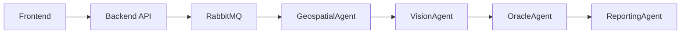

# Estándares de Documentación

## Markdown para Documentación Técnica

Toda la documentación técnica debe escribirse en Markdown con frontmatter YAML válido:

```yaml
---
title: Título de la Página
description: Resumen de 1-2 oraciones del contenido.
order: 1
---
```

### Reglas

- Usar `#` para el título principal (H1), `##` para secciones (H2), `###` para subsecciones (H3)
- Incluir diagramas Mermaid.js para flujos y arquitectura
- Mantener un índice al inicio para documentos extensos (>100 líneas)
- Usar bloques de código con lenguaje especificado (```python, ```javascript, ```bash)

## Comentarios en Código

### Node.js (JSDoc)

```javascript
/**
 * Ingesta datos de una fuente específica.
 * @param {string} source - Identificador de la fuente
 * @param {Array} data - Datos a procesar
 * @returns {Promise<Object>} Resultado de la ingesta
 */
async function ingest(source, data) { ... }
```

### Python (Docstrings)

```python
def calculate_ndvi(nir_band: np.ndarray, red_band: np.ndarray) -> np.ndarray:
    """Calcula el NDVI a partir de bandas NIR y Red.

    Args:
        nir_band: Banda del infrarrojo cercano
        red_band: Banda del rojo visible

    Returns:
        Array 2D con valores NDVI (-1 a 1)
    """
    return (nir_band - red_band) / (nir_band + red_band + 1e-10)
```

## Diagramas Vivos (Mermaid.js)

Astro permite integrar Mermaid.js para que los diagramas de secuencia y flujo se generen desde texto, facilitando su actualización automática.


